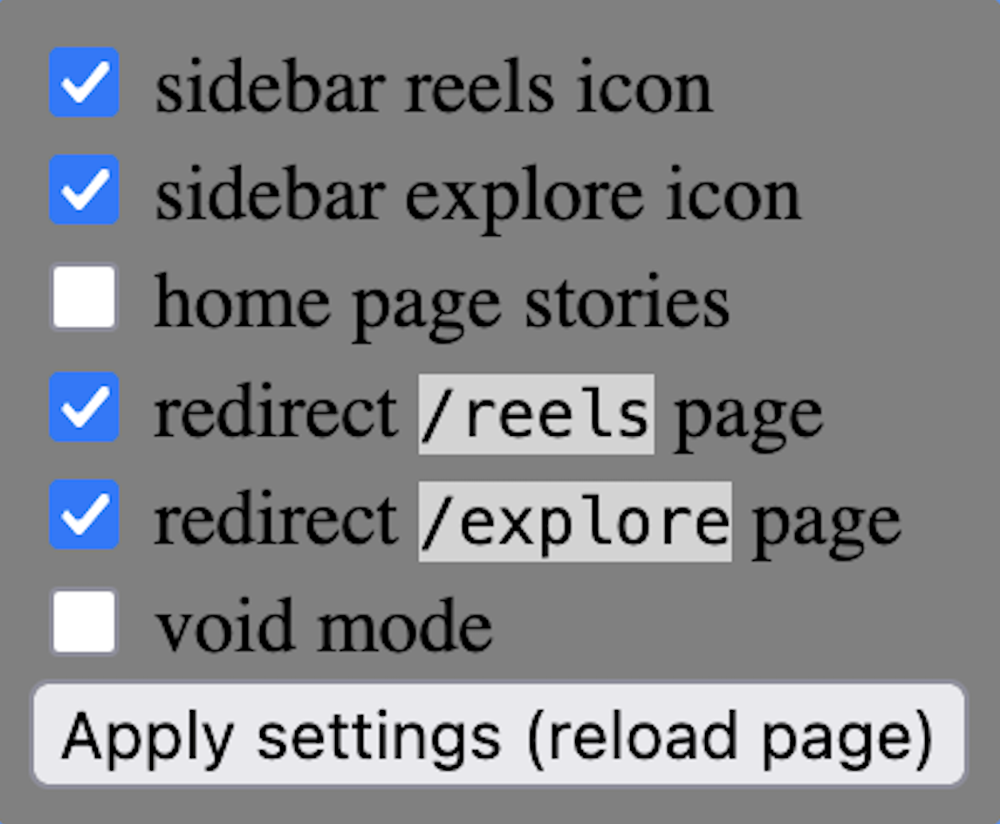

# NoScroll

> A Firefox extension that removes Instagram's most distracting features while keeping messaging and browsing intact.

## Table of Contents

+ [About](#about)
+ [How to install](#how-to-install)
+ [Current features](#current-features)
+ [Currently supported browsers](#currently-supported-browsers)
+ [Privacy Notice](#privacy-notice)
+ [Help development](#help-development)

## About
Every time I open Instagram just to reply to a friend, I eventually end up scrolling. NoScroll was created to remove the most distracting parts of Instagram while keeping messaging and other essential features accessible.

NoScroll is a content blocker for Instagram available for Firefox. With a simple popup UI, you can toggle on/off distracting elements such as Stories, Reels and Explore page.

## How to Install

- Install NoScroll like any other extension via Firefox's addons website. You can find the extension here: [NoScroll for Firefox](https://addons.mozilla.org/en-US/firefox/addon/noscrollinstagram/)
- Alternatively you can download the latest version from the `Releases` tab: [NoScroll for Firefox](https://github.com/Lem0n3de8/NoScroll/releases)
    - To install web extensions from file, go to `about:addons` and select `Install add-on from file` in the gear icon at the top right.

## Current Features:
Contains a simple popup user interface to toggle settings:

| Setting                  | Description |
| ------------------------ | ------------------------ |
| Sidebar reels icon       | Hide the reel icon from the left sidebar |
| Sidebar explore icon     | Hide the explore icon from the left sidebar |
| Home page stories        | Hide the stories at the top of the Home page |
| Redirect `/reels` page   | Redirect any URL containing `instagram/reels` to `instagram.com` |
| Redirect `/explore` page | Redirect any URL containing `instagram/explore` to `instagram.com` |
| Void mode                | Turn the page blank |

## Currently Supported Browsers

**Officially Supported:**
-  Firefox
-  Zen browser

Other Firefox-based browsers may work but have not been tested.

## Privacy Notice
NoScroll is simple and privacy friendly. It does not collect any data or require special permissions.

## Help Development

### Contributions
To submit a pull request you need to first 

Suggested Improvements:
- Test the extension on other browsers
- Improve popup CSS

### Submit an Issue
To submit an issue, check the [issues tab](https://github.com/Lem0n3de8/NoScroll/issues).

----

**Early development** — features and behavior may change.