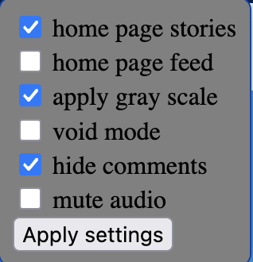

# NoScroll

A Firefox extension that removes Instagram's most distracting features while keeping messaging intact.
    

      
## Table of Contents

+ [About](#about)
+ [How to install](#how-to-install)
+ [Current features](#current-features)
+ [Currently supported browsers](#currently-supported-browsers)
+ [Privacy Notice](#privacy-notice)
+ [Help development](#help-development)

## About
Every time I open Instagram just to reply to a friend, I eventually end up scrolling. NoScroll was created to remove the most distracting parts of Instagram while keeping messaging and other essential features accessible.

NoScroll is a content blocker for Instagram available for Firefox. With a simple popup UI, you can toggle on/off distracting elements such as Stories, Reels and Explore page.

## How to Install

- Install NoScroll like any other extension via Firefox's addons website. You can find the extension here: [NoScroll for Firefox](https://addons.mozilla.org/en-US/firefox/addon/noscrollinstagram/)
- Alternatively you can download the latest version from the `Releases` tab: [NoScroll for Firefox](https://github.com/Lem0n3de8/NoScroll/releases)
    - To install web extensions from file, go to `about:addons` and select `Install add-on from file` in the gear icon at the top right.

## Current Features:
Contains a simple popup user interface to toggle settings:

| Setting                  | Description |
| ------------------------ | ------------------------ |
| Home page stories        | Hide the stories at the top of the Home page |
| Home page feed           | Hide the home page posts and reels |
| Apply grayscale          | Add grayscale covering the whole website |
| Void mode                | Turn the page blank |
| Hide comments            | Disable comments button and comments section |
| Mute audio               | Turn off all sound |

There is also some content removed by default:
- Reels (redirected to homepage)
- Reels sidebar button
- Explore page posts suggestions (search feature still functional)

## Currently Supported Browsers

**Officially Supported:**
-  Firefox
-  Zen browser

Other Firefox-based browsers may work but have not been tested.

**Experimental:** Starting with v0.7.0, I'm trying to add support for android

## Privacy Notice
NoScroll is simple and privacy friendly. It does not collect any data or require special permissions.

## Help Development

**For more information, visit the [Contributing page](https://github.com/Lem0n3de8/NoScroll?tab=contributing-ov-file).**

**To submit an issue, check the [issues tab](https://github.com/Lem0n3de8/NoScroll/issues).**

----

**Early development** — features and behavior may change.